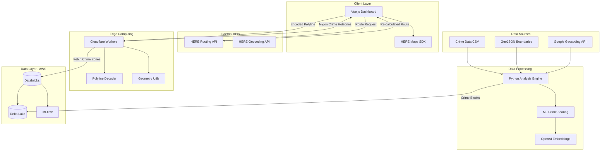
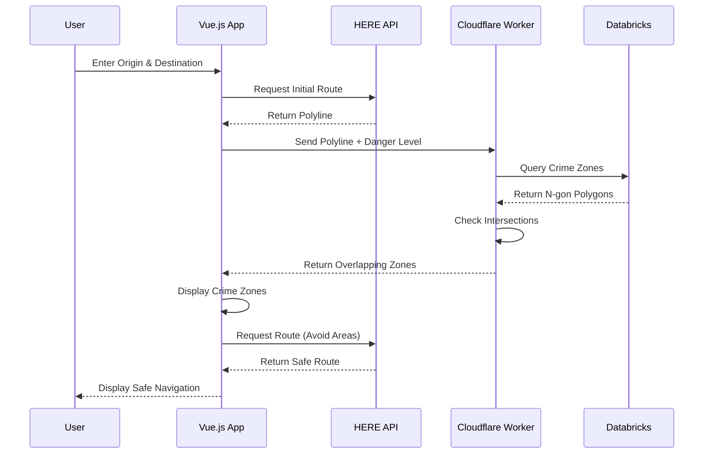
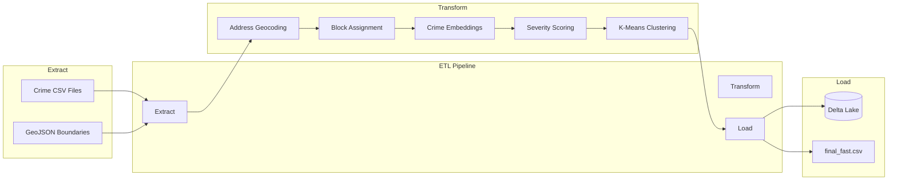
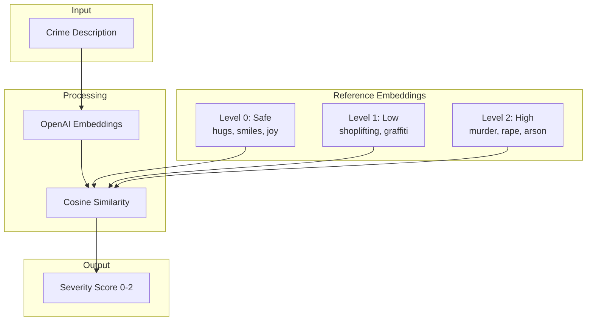

<p align="center">
  
</p>

<h1 align="center">Albatross</h1>

<p align="center">
  <strong>Get home faster. Safer. Smarter.</strong>
</p>

<p align="center">
  <a href="#overview">Overview</a> &bull;
  <a href="#features">Features</a> &bull;
  <a href="#architecture">Architecture</a> &bull;
  <a href="#tech-stack">Tech Stack</a> &bull;
  <a href="#repositories">Repositories</a> &bull;
  <a href="#getting-started">Getting Started</a> &bull;
  <a href="#team">Team</a>
</p>

---

## Overview

**Albatross** is an AI-powered navigation system that prioritizes your safety by calculating routes that avoid crime hot-zones. Like the albatross bird that never fails to find its way home, our application ensures you reach your destination through the safest possible path.

> *"There are many ingredients that go into Smart Cities. But one that often gets forgotten amidst the great technological advancements and futuristic dreams is safety."*

Traditional navigation apps optimize for distance or time. Albatross optimizes for **your safety**. By aggregating criminal history data with real-time traffic and city layout information, we provide quick, safe, and efficient routing.

### The Problem

Many of us have experienced moments when navigation apps have led us into areas that felt unsafe or uneasy. Current routing solutions don't factor in neighborhood safety, leaving users vulnerable to potentially dangerous situations.

### The Solution

Albatross uses machine learning to:
- Analyze historical crime data
- Generate dynamic crime hot-zones
- Calculate routes that intelligently avoid high-risk areas
- Provide real-time rerouting based on safety scores

---

## Features

- **Interactive Map Interface** - Beautiful, intuitive map powered by HERE Maps API
- **Multi-Modal Transportation** - Support for car, pedestrian, bicycle, truck, scooter, taxi, and bus
- **Adjustable Danger Sensitivity** - Customize your safety threshold with a danger level slider (0-5)
- **Current Location Detection** - One-click access to your current position
- **Dark Mode** - Easy on the eyes for night navigation
- **Place Search with Autocomplete** - Quick destination finding
- **Route Instructions** - Turn-by-turn navigation with time and distance estimates
- **Crime Zone Visualization** - See danger zones highlighted on the map

---

## Architecture

### System Design

<p align="center">
  
</p>

### System Overview



### Data Flow



### Crime Data Processing Pipeline



### Crime Severity Classification



---

## Tech Stack

### Frontend
| Technology | Purpose |
|------------|---------|
| Vue.js 3.x | Reactive UI Framework |
| Vite | Fast Development Server |
| Pinia | State Management |
| HERE Maps SDK | Interactive Mapping |

### Edge Computing
| Technology | Purpose |
|------------|---------|
| Cloudflare Workers | Serverless Edge Functions |
| JavaScript ES6+ | Worker Logic |

### Data Processing
| Technology | Purpose |
|------------|---------|
| Python 3.x | Data Analysis |
| OpenAI Embeddings | Crime Text Embeddings |
| scikit-learn | K-Means Clustering |
| NumPy | Numerical Processing |

### Data Storage
| Technology | Purpose |
|------------|---------|
| Databricks | Unified Analytics |
| Delta Lake | ACID Data Lake |
| Apache Spark | Distributed Computing |
| MLflow | ML Lifecycle Management |

### APIs
| Service | Purpose |
|---------|---------|
| HERE Routing API | Optimal Pathfinding |
| HERE Geocoding API | Address to Coordinates |
| HERE Autosuggest API | Search Autocomplete |
| Google Geocoding API | Batch Address Resolution |

---

## Repositories

This project is organized into multiple repositories for better maintainability:

| Repository | Description | Link |
|------------|-------------|------|
| **albatross-frontend** | Vue.js web application with HERE Maps integration | [View Repo](https://github.com/YOUR_USERNAME/albatross-frontend) |
| **albatross-cloudflare** | Cloudflare Workers for edge computing and polygon intersection | [View Repo](https://github.com/YOUR_USERNAME/albatross-cloudflare) |
| **albatross-databricks** | Scala notebooks for Databricks/Delta Lake setup | [View Repo](https://github.com/YOUR_USERNAME/albatross-databricks) |
| **albatross-analysis** | Python scripts for crime data processing and ML | [View Repo](https://github.com/YOUR_USERNAME/albatross-analysis) |

---

## Getting Started

### Prerequisites

- Node.js 18+
- Python 3.9+
- Cloudflare Account (for Workers)
- Databricks Account
- HERE Developer Account
- OpenAI API Key

### 1. Frontend Setup

```bash
# Clone the frontend repository
git clone https://github.com/YOUR_USERNAME/albatross-frontend.git
cd albatross-frontend

# Install dependencies
npm install

# Configure environment variables
cp .env.example .env
# Add your HERE API key to .env

# Start development server
npm run dev
```

**Configuration (`src/MapPage.vue` & `src/components/HereMap.vue`):**
```javascript
// Replace with your HERE API key
apiKey: 'YOUR_HERE_API_KEY'
```

### 2. Cloudflare Workers Setup

```bash
# Clone the cloudflare repository
git clone https://github.com/YOUR_USERNAME/albatross-cloudflare.git
cd albatross-cloudflare

# Install Wrangler CLI
npm install -g wrangler

# Login to Cloudflare
wrangler login

# Deploy the worker
wrangler deploy
```

**Worker Files:**
- `worker.js` - Main request handler
- `polylineDecoder.js` - Flexible polyline decoding
- `geometryUtils.js` - Polygon intersection algorithms
- `polygonFetcher.js` - Databricks data fetching

### 3. Data Processing Setup

```bash
# Clone the analysis repository
git clone https://github.com/YOUR_USERNAME/albatross-analysis.git
cd albatross-analysis

# Create virtual environment
python -m venv venv
source venv/bin/activate  # On Windows: venv\Scripts\activate

# Install dependencies
pip install numpy scikit-learn openai requests polyline

# Set OpenAI API key
export OPENAI_API_KEY='your-api-key'

# Run the analysis pipeline
python analyze.py
```

**Required Data Files:**
```
datafiles/
├── usa.geojson          # US Census block boundaries
├── boston_crime.csv     # Boston crime incidents
├── crime.csv            # Additional crime data
└── final_fast.csv       # Output: processed crime zones
```

### 4. Databricks Setup

1. Create a Databricks workspace on AWS
2. Upload the Scala notebooks:
   - `Create4gonDeltaLake.scala` - Initialize Delta Lake tables
   - `CrimeDataProcessing.scala` - Process and store crime data
3. Upload crime data CSV to DBFS
4. Run notebooks in order

**Delta Lake Schema:**
```scala
val schema = StructType(Array(
  StructField("vertex1_lat", DoubleType),
  StructField("vertex1_lon", DoubleType),
  StructField("vertex2_lat", DoubleType),
  StructField("vertex2_lon", DoubleType),
  StructField("vertex3_lat", DoubleType),
  StructField("vertex3_lon", DoubleType),
  StructField("vertex4_lat", DoubleType),
  StructField("vertex4_lon", DoubleType),
  StructField("crime_score", DoubleType)
))
```

---

## How It Works

### Crime Zone Generation

1. **Data Ingestion**: Crime incident data is loaded from CSV files containing addresses, crime descriptions, and timestamps.

2. **Geocoding**: Addresses are converted to latitude/longitude coordinates using Google's Geocoding API.

3. **Block Assignment**: Each crime is assigned to a census block polygon using ray-casting algorithm.

4. **Severity Scoring**: Crime descriptions are embedded using OpenAI's text-embedding model and compared against reference severity levels using cosine similarity.

5. **Zone Classification**: Blocks are ranked by crime density (crimes per capita) and classified into 5 danger levels:
   - **Level 5** (Top 2%): Most dangerous
   - **Level 4** (Top 5%): Very dangerous
   - **Level 3** (Top 10%): Dangerous
   - **Level 2** (Top 50%): Moderate risk
   - **Level 1** (Bottom 50%): Low risk

6. **Polygon Simplification**: Complex census boundaries are simplified to 4-sided polygons (N-gons) using K-Means clustering for efficient storage and intersection testing.

### Route Calculation

1. User enters origin and destination
2. Initial route is calculated via HERE Routing API
3. Polyline is sent to Cloudflare Worker
4. Worker decodes polyline and checks intersections with crime zones
5. Matching danger zones are returned to frontend
6. Route is recalculated with `avoid[areas]` parameter
7. Safe route is displayed with crime zones visualized

---

## Future Roadmap

- [ ] **Real-time Notifications** - Push alerts for nearby incidents
- [ ] **Personalized Safety** - User-specific risk preferences
- [ ] **AI Crime Prediction** - Predictive models for emerging hot-zones
- [ ] **Mobile Apps** - Native iOS and Android applications
- [ ] **Community Reports** - Crowdsourced safety data
- [ ] **Time-based Routing** - Different routes for day vs. night
- [ ] **Integration with 911** - Emergency service coordination

---

## Accomplishments

- Completed all core functionalities within hackathon timeframe
- Successfully integrated multiple new technologies (Databricks, Cloudflare Workers)
- Built efficient real-time crime data clustering system
- Implemented flexible polyline encoding workarounds
- Created scalable architecture for future enhancements

---

## What We Learned

- **Databricks & Delta Lake** - Unified analytics platform and ACID transactions
- **Cloudflare Workers** - Edge computing for low-latency processing
- **HERE APIs** - Geo-routing and flexible polyline encoding
- **Vue.js** - Reactive frontend development
- **Scala & Spark** - Distributed data processing
- **ML Embeddings** - Text similarity for crime classification

---

## Contributing

We welcome contributions! Please see our [Contributing Guidelines](CONTRIBUTING.md) for details.

1. Fork the repository
2. Create your feature branch (`git checkout -b feature/AmazingFeature`)
3. Commit your changes (`git commit -m 'Add some AmazingFeature'`)
4. Push to the branch (`git push origin feature/AmazingFeature`)
5. Open a Pull Request

---

## License

This project is licensed under the MIT License - see the [LICENSE](LICENSE) file for details.

---

## Team

Built with love at HackHarvard 2024

<!-- Add team member info here -->

| Name | Role | GitHub |
|------|------|--------|
| Shahir Ahmed | Full Stack | [@Shahir-47](https://github.com/Shahir-47) |
| Boosung Kim | Full Stack | [@boosungkim](https://github.com/boosungkim) |
| Jordan Zedeck | Full Stack | [@zedeckj](https://github.com/zedeckj) |

---

## Acknowledgments

- [HERE Technologies](https://developer.here.com/) for mapping APIs
- [Databricks](https://databricks.com/) for data platform
- [Cloudflare](https://workers.cloudflare.com/) for edge computing
- [OpenAI](https://openai.com/) for embeddings API
- Boston Police Department for open crime data

---

<p align="center">
  <strong>Albatross - Because everyone deserves to get home safe.</strong>
</p>

<p align="center">
  <a href="https://devpost.com/software/albatross">View on Devpost</a> &bull;
  <a href="#getting-started">Get Started</a> &bull;
  <a href="https://github.com/YOUR_USERNAME/albatross-frontend/issues">Report Bug</a>
</p>
